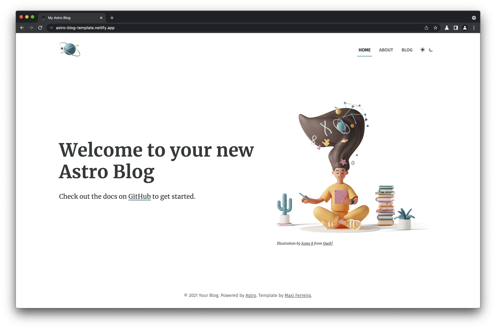

# [Astro](https://astro.build) Blog Template

[](https://astro-blog-template.netlify.app/)

## 👉 Check out the ✨ [Live Demo](https://astro-blog-template.netlify.app/) ✨

## 👩‍🚀 Getting Started

### Locally

```
npm init astro -- --template Charca/astro-blog-template
```

### On StackBlitz

[](https://stackblitz.com/github/charca/astro-blog-template)

## ✨ Features:

- ✅ Astro 4.0
- ✅ Dark Mode
- ✅ Full Markdown support
- ✅ SEO-friendly setup with canonical URLs and OpenGraph data
- ✅ RSS 2.0 generation
- ✅ Sitemap.xml generation

## 🚀 Project Structure

Inside of your Astro project, you'll see the following folders and files:

```
/
├── public/
│   ├── robots.txt
│   └── favicon.ico
├── src/
│   ├── components/
│   │   └── Tour.astro
│   └── pages/
│       └── index.astro
└── package.json
```

Astro looks for `.astro` or `.md` files in the `src/pages/` directory. Each page is exposed as a route based on its file name.

There's nothing special about `src/components/`, but that's where we like to put any Astro/React/Vue/Svelte/Preact components.

Any static assets, like images, can be placed in the `public/` directory.

## 🧞 Commands

All commands are run from the root of the project, from a terminal:

| Command           | Action                                       |
| :---------------- | :------------------------------------------- |
| `npm install`     | Installs dependencies                        |
| `npm run dev`     | Starts local dev server at `localhost:3030`  |
| `npm run build`   | Build your production site to `./dist/`      |
| `npm run preview` | Preview your build locally, before deploying |

## 👀 Want to learn more?

Feel free to check [Astro's documentation](https://github.com/withastro/astro) or jump into Astro's [Discord server](https://astro.build/chat).
# jmckirgan.github.io
